# Bank Fraud Detection ML

This project is about detecting fraud transactions using machine learning.

I used bank transaction dataset and tried to find patterns which can help identify fraud.

---

## Step 1: Loading data

Data was loaded using spark into dataframe.

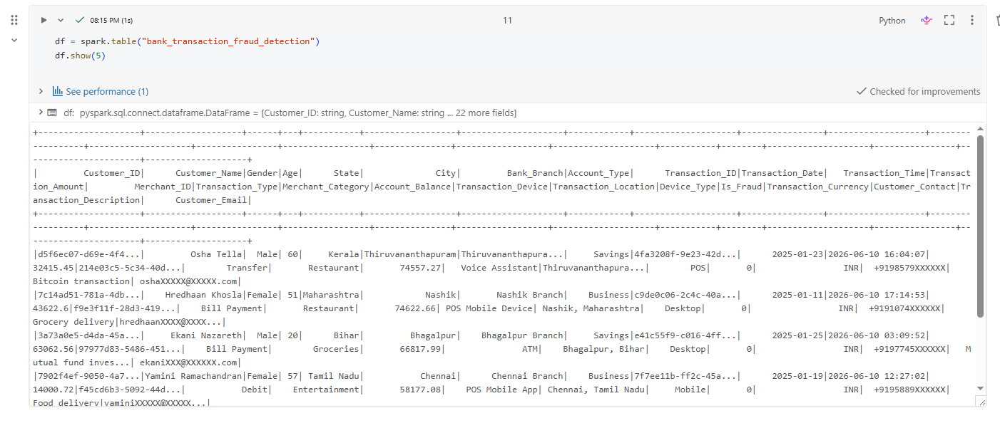

Also viewed data in Databricks using SQL.

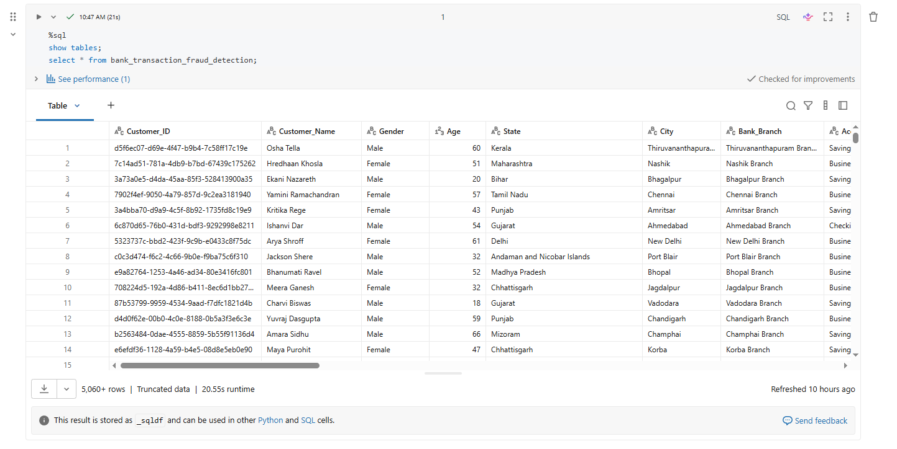

---

## Step 2: Understanding patterns

I checked different columns to see if fraud has any pattern.

Some features showed weak patterns:

* age
* account type
* device type
* transaction type
* merchant category
* location

Examples:

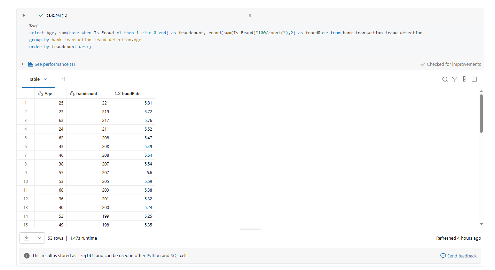

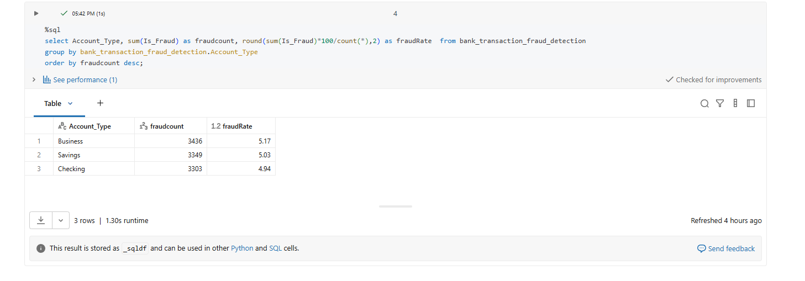

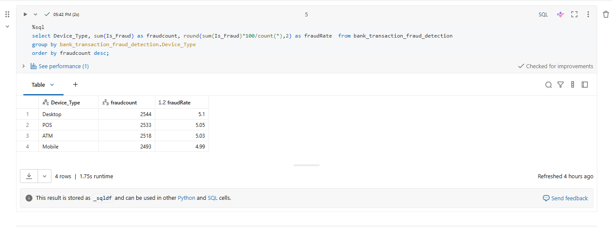

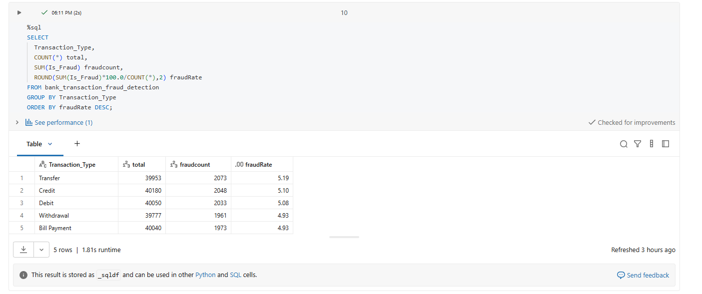

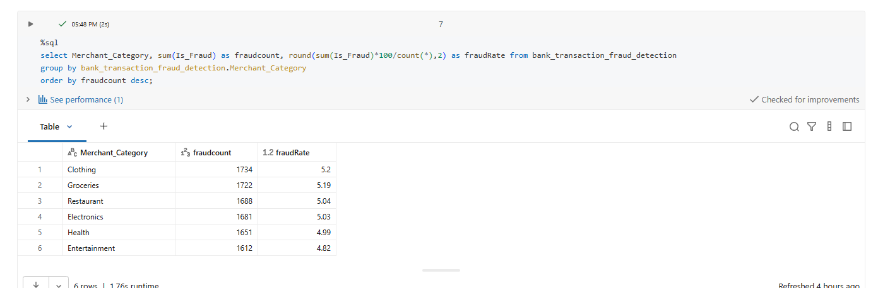

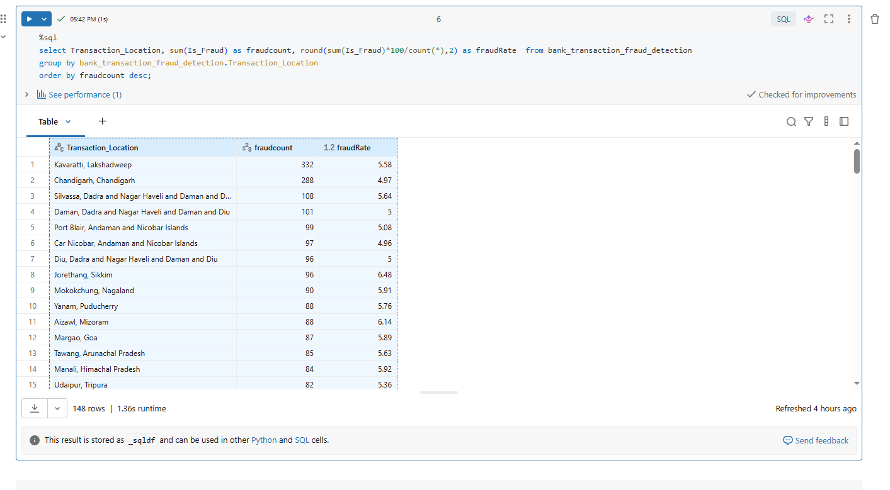

There was one medium level pattern in transaction amount:

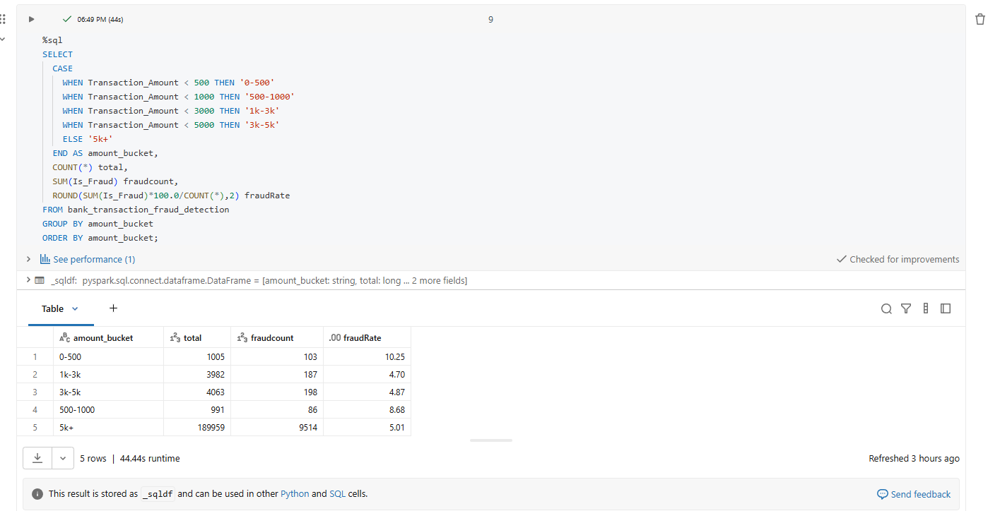

---

## Step 3: Feature Engineering

Created new columns to help model understand behavior better.

* high amount
* transaction hour
* night transaction flag
* customer transaction count
* average amount per customer
* difference from average

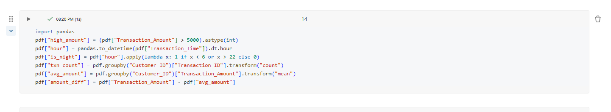

---

## Step 4: Preparing data

Separated features and target variable.

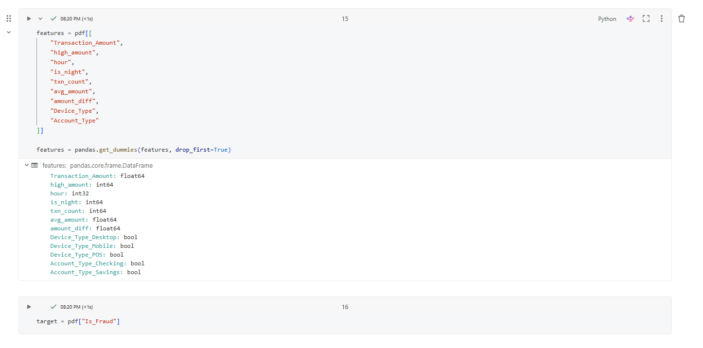

Then created train and test split and applied model.

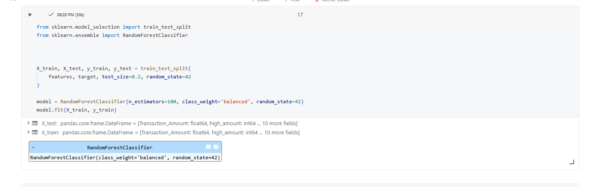

---

## Step 5: Model evaluation

Used Random Forest model.

Accuracy was high but fraud detection was low because dataset is imbalanced.

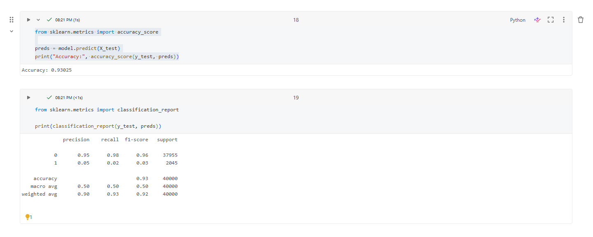

---

## Conclusion

* Most features had weak pattern
* Feature engineering helped create better signals
* Model accuracy is high but recall for fraud is low
* Need to handle imbalance better to improve results

---

## Future Improvement

* Handle class imbalance
* Try other models
* Improve feature engineering
* Focus more on fraud recall

---
